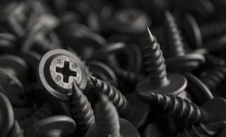
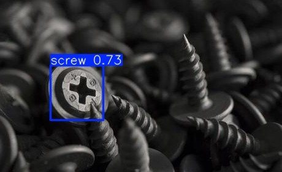
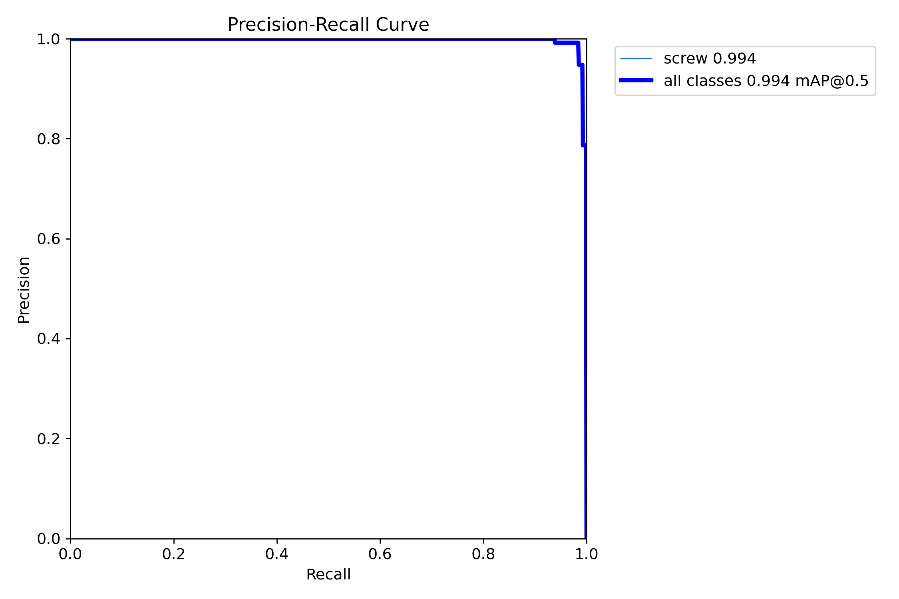
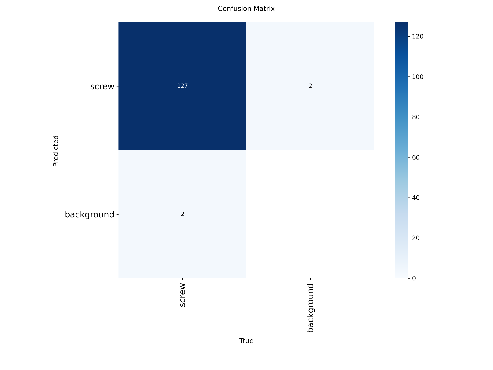

# Screw Head Detection using YOLOv8 with 5-Fold Cross-Validation

## Overview

This project implements an automated screw head detection system using the YOLOv8 object detection framework. The model was trained on a Roboflow dataset and evaluated using 5-fold cross-validation to obtain reliable and unbiased performance metrics.

The project includes dataset preparation, fold generation, model training, evaluation, inference, and cloud deployment using Streamlit Community Cloud, providing a complete and reproducible computer vision pipeline.

---

## Live Demo

The application is deployed on **Streamlit Community Cloud**, allowing users to perform screw head detection directly through a web browser without any local installation.

**Application:** [Live Demo]()

---

## Sample Prediction

<div align="center">

<table>
<tr>
<td align="center">

**Input Image**



</td>

<td align="center">

**Detection Result**



</td>
</tr>
</table>

</div>

---

## Dataset

The dataset was obtained from **Roboflow Universe**.

| Property | Value |
|----------|-------|
| Classes | 1 |
| Class Name | Screw |
| Total Images | 522 |
| Training Images | 417 |
| Validation Images | 105 |

The original training and validation sets were merged before performing cross-validation.

---

## Model Configuration

| Parameter | Value |
|-----------|-------|
| Model | YOLOv8n |
| Framework | Ultralytics |
| Image Size | 640 × 640 |
| Batch Size | 16 |
| Epochs | 50 |
| Cross Validation | 5 Folds |
| Random Seed | 42 |

---

## Cross-Validation Procedure

The combined dataset was divided into five equally sized folds using Scikit-Learn's `KFold` with `shuffle=True` and `random_state=42`.

For each experiment:

- One fold was used for validation.
- The remaining four folds were used for training.
- The process was repeated five times so that every image served as validation exactly once.

| Run | Training Folds | Validation Fold |
|-----|----------------|-----------------|
| 1 | 2, 3, 4, 5 | 1 |
| 2 | 1, 3, 4, 5 | 2 |
| 3 | 1, 2, 4, 5 | 3 |
| 4 | 1, 2, 3, 5 | 4 |
| 5 | 1, 2, 3, 4 | 5 |

---

## Performance

### Average Cross-Validation Results

| Metric | Value |
|--------|------:|
| Precision | **92.18%** |
| Recall | **90.30%** |
| mAP@50 | **94.78%** |
| mAP@50-95 | **76.47%** |

### Fold-wise Results

| Fold | Precision | Recall | mAP@50 | mAP@50-95 |
|------|----------:|--------:|--------:|----------:|
| 1 | 0.8359 | 0.8359 | 0.8418 | 0.6802 |
| 2 | 0.8923 | 0.9249 | 0.9644 | 0.7452 |
| 3 | **0.9978** | **0.9767** | **0.9943** | **0.8393** |
| 4 | 0.9168 | 0.9328 | 0.9787 | 0.7882 |
| 5 | 0.9661 | 0.8446 | 0.9598 | 0.7708 |

---

## Evaluation

<div align="center">

<table>
<tr>

<td align="center" width="50%">

**Precision-Recall Curve**



</td>

<td align="center" width="50%">

**Confusion Matrix**



</td>

</tr>
</table>

</div>

---

## Cloud Deployment

The application has been deployed using **Streamlit Community Cloud**.

The deployed web application provides:

- Image upload through a web interface
- Screw head detection using the trained YOLOv8 model
- Annotated output image with detected screw heads
- Detection summary including:
  - Number of detected screw heads
  - Confidence score for each detection
  - Average detection confidence

---

## Repository Structure

```text
screw-head-detection-yolov8/
│
├── app.py
├── configs/
├── images/
├── models/
├── notebook/
├── results/
├── src/
├── README.md
├── requirements.txt
└── LICENSE
```

---

## Installation

Clone the repository.

```bash
git clone https://github.com/Akshith-cdr/screw-head-detection-yolov8.git
cd screw-head-detection-yolov8
```

Install the required dependencies.

```bash
pip install -r requirements.txt
```

---

## Usage

Merge the original dataset.

```bash
python src/merge_dataset.py
```

Create the five cross-validation folds.

```bash
python src/create_folds.py
```

Train the YOLOv8 model.

```bash
python src/train.py
```

Evaluate the trained models.

```bash
python src/validate.py
```

Run inference locally.

```bash
python src/predict.py --image images/sample_input.jpg
```

Or use the deployed Streamlit application through your web browser.

---

## Technologies Used

- Python
- YOLOv8 (Ultralytics)
- PyTorch
- OpenCV
- NumPy
- Pandas
- Matplotlib
- Scikit-Learn
- Roboflow
- Google Colab
- Streamlit

---

## Applications

- Industrial quality inspection
- Manufacturing automation
- Robotics
- Smart factory systems
- Automated visual inspection

---

## Future Work

- Improve screw head detection accuracy
- Train larger YOLOv8 variants
- Increase dataset size
- Support multiple screw categories
- Brand marker detection and extraction
- Real-time video inference
- Edge deployment on embedded devices

---

## License

This project is licensed under the MIT License.